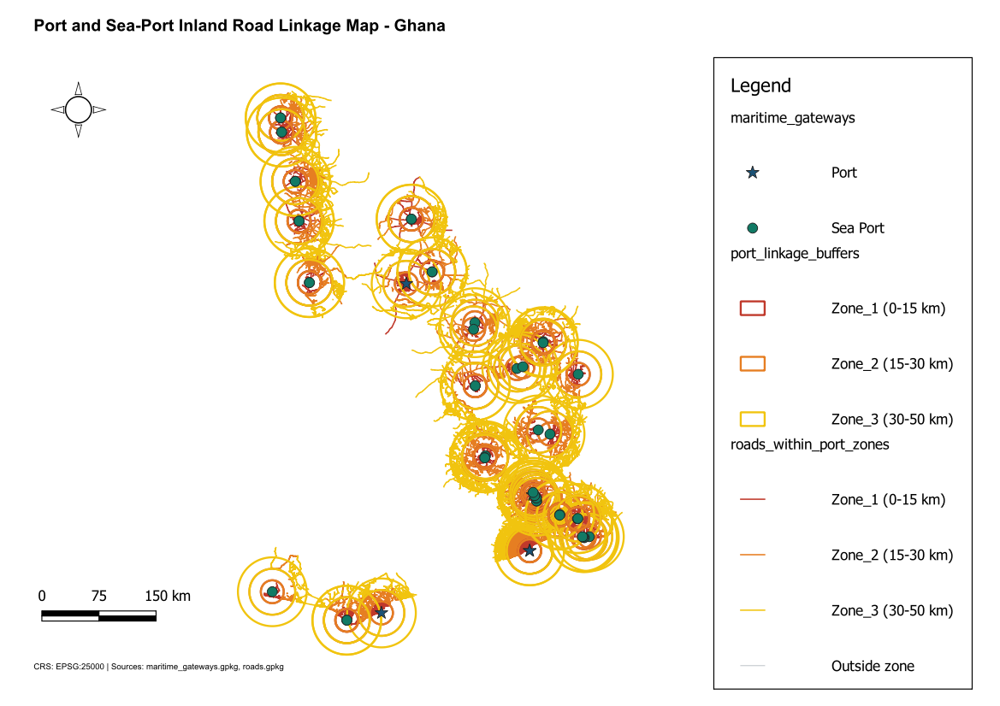

# Port and Sea-Port Inland Road Linkage Map

**Country:** Ghana
**CRS:** EPSG:25000 - Leigon / Ghana Metre Grid
**Project file:** `Port_SeaPort_Inland_Road_Linkage_Map.qgz`

---

## Overview

This project maps the road infrastructure within defined corridor zones around Ghana's ports and seaports to assess inland road linkage capacity. Buffer zones are drawn around each maritime gateway to simulate a port hinterland, and road segments within those zones are extracted and characterised. The output informs logistics planning, trade corridor investment, and port efficiency assessments.

## Reference Layout

---

## Objectives

- Define inland linkage buffer zones around each port and seaport facility.
- Extract road segments within each port linkage zone.
- Assess road coverage and type within port hinterlands.

## Methodology

1. Maritime gateways (ports and seaports) reprojected to EPSG:25000 and stored as `maritime_gateways.gpkg`.
2. Linkage buffer zones generated around each port: `port_linkage_buffers.gpkg`.
3. Road network clipped to port linkage zones: `roads_within_port_zones.gpkg`.
4. Layers styled in the QGIS print layout and exported.

## Output Layers

| File | Description |
|------|-------------|
| `maritime_gateways.gpkg` | Port and seaport locations reprojected to EPSG:25000 |
| `port_linkage_buffers.gpkg` | Buffer zones defining inland hinterland around each port |
| `roads_within_port_zones.gpkg` | Road segments within port linkage corridor zones |

## Key Findings

- Tema Port has the densest road network within its linkage zone, consistent with its role as Ghana's primary commercial port and its integration into the Greater Accra road grid.
- Takoradi's linkage zone contains a functional arterial road network connecting to the Western Region mining and timber corridors.
- Smaller coastal entry points show limited road coverage within their linkage zones, indicating poor integration with the national freight network.

## Deliverables

| File | Type |
|------|------|
| `Port_SeaPort_Inland_Road_Linkage_Map.qgz` | QGIS project |
| `Port_SeaPort_Inland_Road_Linkage_Map.pdf` | Exported map layout |
| `reference_layout.png` | Print layout reference image |

## Notes

- All layers use EPSG:25000 (Leigon / Ghana Metre Grid).
- This project complements the Maritime Trade Corridor and Inland Linkage Map in the 01-06-2026 folder, which includes rail in addition to roads.

---

## Map Preview

